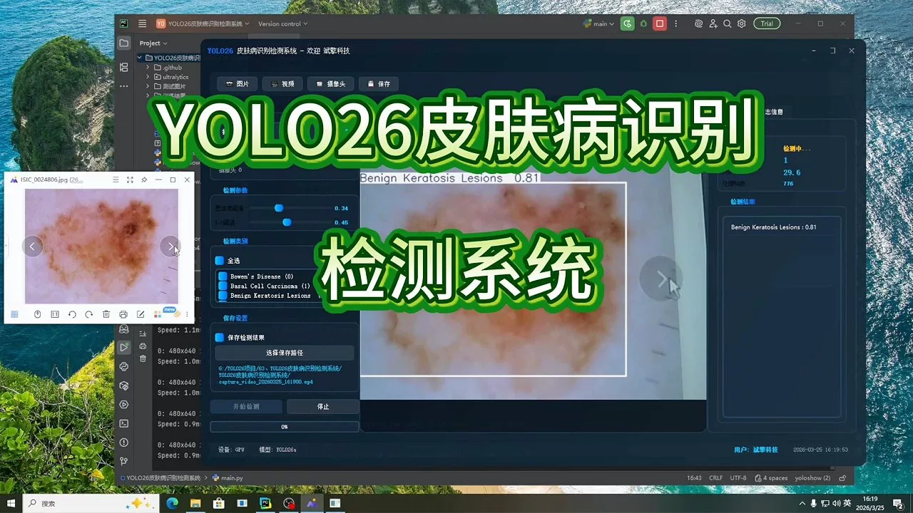
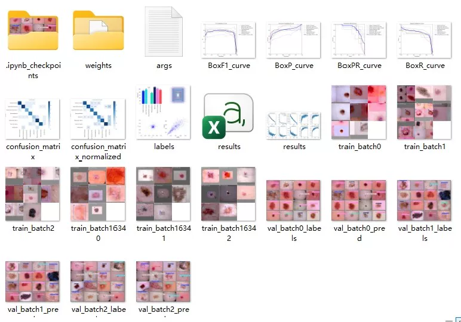
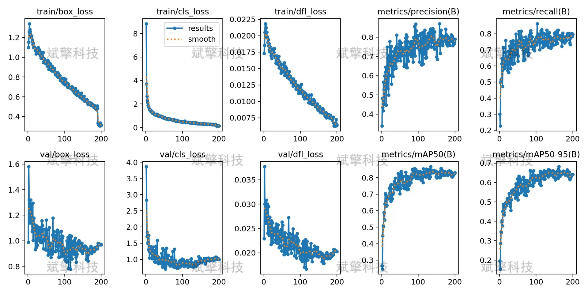
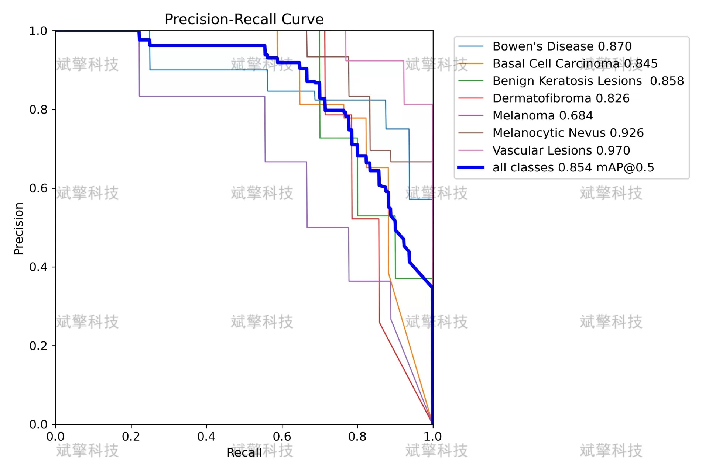
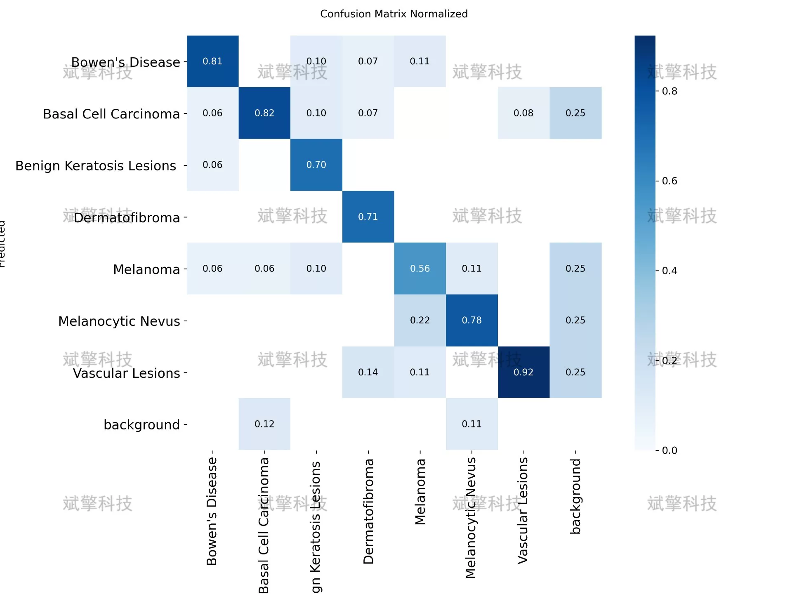
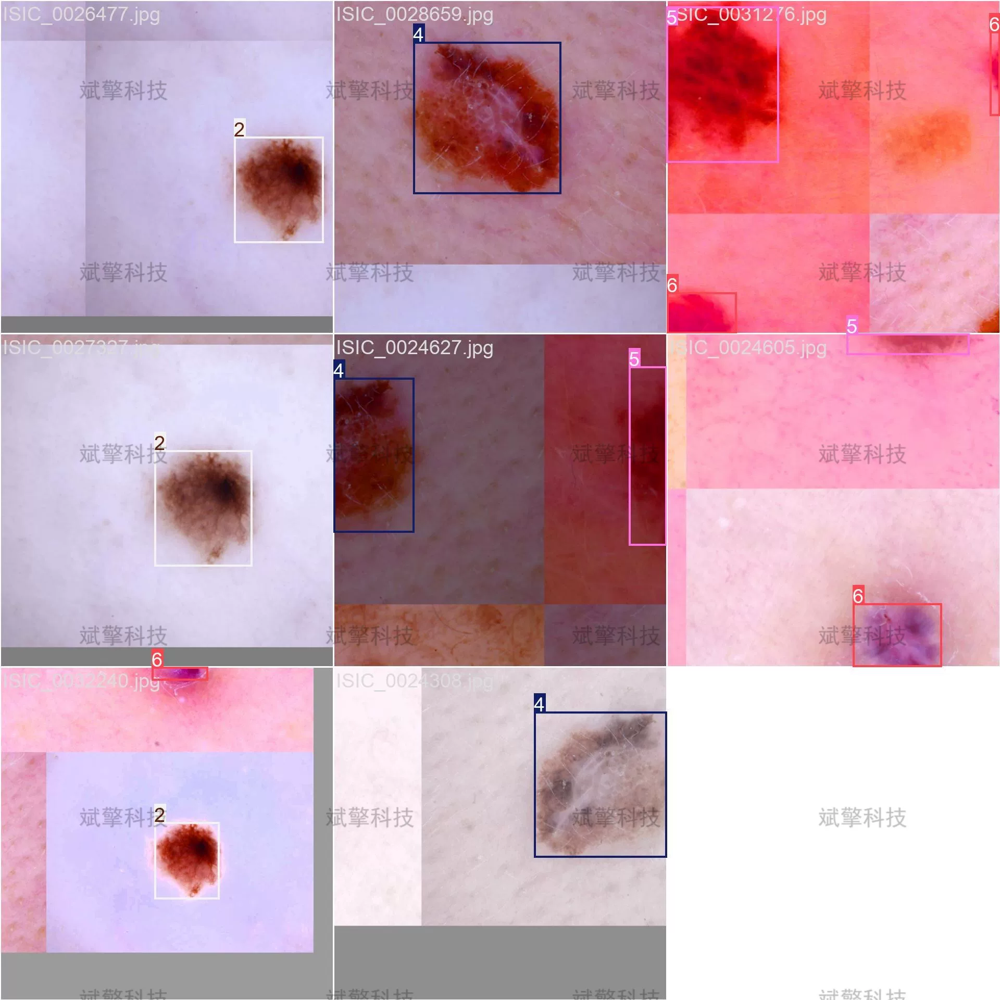
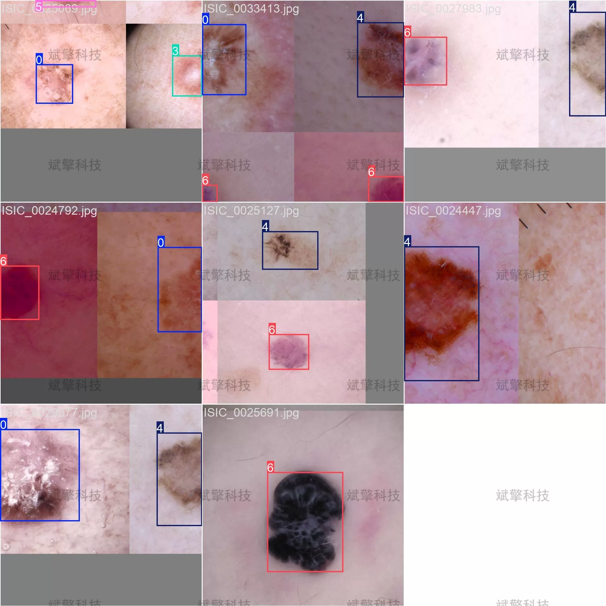
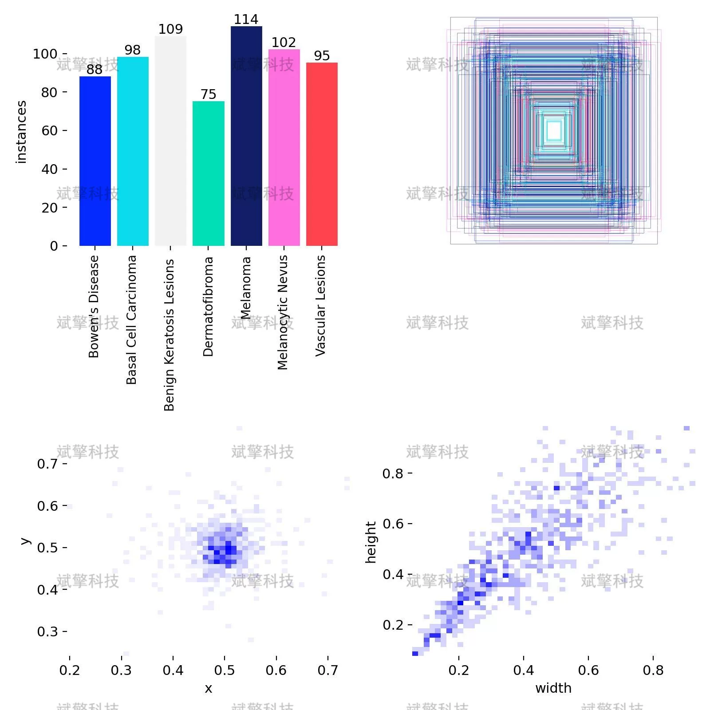

# YOLOv26 dermatology disease recognition detection system | dataset

## Body

YOLO26 Skin Disease Identification Detection System | Dataset: YOLO26 Powers Medical Imaging: A 95% Recall Rate for Seven Types of Skin Lesions, Skin Disease Identification Detection (Project Source Code + Dataset + Model Weights + UI Interface + Python + Deep Learning + Remote Deployment)

Skin cancer is one of the most common malignant tumors worldwide, and early accurate diagnosis is crucial for improving patient survival rates. This paper builds an automatic recognition detection system for seven common skin lesion types based on the YOLO26 object detection algorithm. The research dataset includes 681 training images, 97 validation images, and 195 test images, covering seven types of skin lesions including Bowen's Disease, Basal Cell Carcinoma, Benign Keratosis Lesions, Dermatofibroma, Melanoma, Melanocytic Nevus, and Vascular Lesions. The experimental results show that the model achieved an average precision rate of 85.4% and a recall rate of 95.0% on the test set, with the detection effects of Vascular Lesions and Melanocytic Nevus being the best, with precision rates reaching 97.0% and 92.6%, respectively. This study verifies the application potential of the YOLO26 algorithm in the field of skin disease identification, while also pointing out directions for improvement in category balance and feature differentiation.

Bowen's Disease, Bowen's Disease, In situ Squamous Cell Carcinoma, characterized by red patches with clear boundaries.
Basal Cell Carcinoma, Basal Cell Carcinoma, the most common skin malignancy, grows slowly with strong local destruction.
Benign Keratosis Lesions, Benign Keratosis Lesions, including seborrheic keratosis, among other benign lesions, with diverse morphology.
Dermatofibroma, Dermatofibroma, benign fibroproliferative proliferation of fibrous tissue, commonly found on the limbs, with hard texture.
Melanoma, Melanoma, the most malignant skin tumor, prone to metastasis, and has a high mortality rate.
Melanocytic Nevus, Melanocytic Nevus, benign pigmented nevus, but some types may have malignant transformation potential.
Vascular Lesions, Vascular Lesions, including hemangiomas, vascular keratoses, etc., presenting as red or purple.

Free appointment for remote installation. Unsuccessful installation will result in a full refund.
Purchase comes with the following resources (unlocked in Baidu Cloud):
- Full source code of the YOLO recognition detection project
- YOLO format dataset
- Training code + UI interface code
- Trained model + result images
- Software installer
- Add WeChat to make an appointment for remote installation (automatically displayed after purchase) - Unsuccessful, full refund

⚙️ Core Function Modules
Detection Capability
- Image detection: upload and check immediately, returning detection boxes + category information
- Video detection: supports video files, analyzing frames accurately
- Camera real-time detection: connects USB camera for dynamic monitoring
Interaction and Control
- Target selection: freely choose one or more categories for detection
- Real-time parameter adjustment: adjustable confidence threshold & IoU threshold, flexible control over accuracy
- Results saving: save images/videos/camera detection results in one click
System and Data
- User login registration: supports password strength checking + encryption storage
- Log recording: automatically records operation and error information (timestamped)

## Images

## Payment

Here is a pay link on Stripe ( https://buy.stripe.com/3cs8yP7sY87d0vu9AB ). Please contact me lonlonago@foxmail.com after funding $89, and I will send you a complete data files , thank you!

